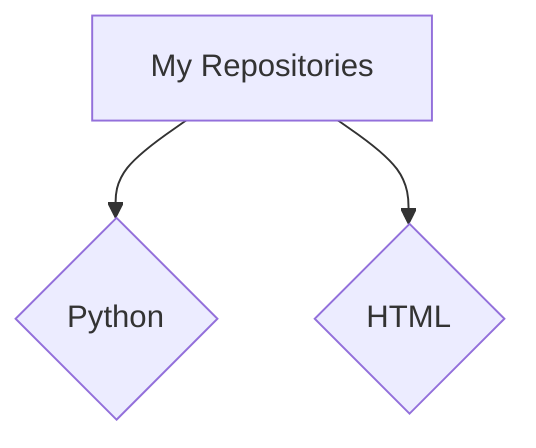

  <h1>Hi there, I'm Visiuun :3</h1>

  

  
A Python enthusiast and developer from Italy. I love automating tasks and exploring cryptography. Femboy and code enjoyer.

  

    <a href="https://visiuun.com" target="_blank">Portfolio</a> |
    <a href="https://Instagram.com/visiuun" target="_blank">Instagram</a> |
    <a href="mailto:visiuun@visiuun.com">Email</a>
  

  

    
  

## 🛠️ My Projects

Here's a glimpse into my GitHub repositories:

### Python Automation & Utilities

- **[Kemono.su-Downloader](https://github.com/visiuun/Kemono.su-Downloader):** A Python bulk downloader for Kemono.su, enabling users to download content easily.
  - Tags: `python`, `downloader`, `bulk`, `kemono`, `kemono-party`
- **[Coomer.su-Downloader](https://github.com/visiuun/Coomer.su-Downloader):** Similar to Kemono.su, but for Coomer.su.
  - Tags: `python`, `downloader`, `bulk`, `coomer`, `coomer-party`
- **[PyR34-Downloader](https://github.com/visiuun/PyR34-Downloader):** Bulk downloader for rule34, using tag inputs.
  - Tags: `python`, `downloader`, `bulk`, `rule34`
- **[Bulk-folder-extractor](https://github.com/visiuun/Bulk-folder-extractor):** Automates the extraction of folders.
  - Tags: `python`, `extractor`, `folder`, `automatic`
- **[Bulk-archive-compressor](https://github.com/visiuun/Bulk-archive-compressor):** Compresses archives in bulk.
  - Tags: `python`, `compression`, `archive`, `automatic`
- **[Archive-Extraction-Tool](https://github.com/visiuun/Archive-Extraction-Tool):** Extracts archives in bulk.
  - Tags: `python`, `extractor`, `archive`
- **[Duplicate-files-deleter](https://github.com/visiuun/Duplicate-files-deleter):** Deletes duplicate files from directories.
  - Tags: `python`, `files`, `duplicate-files`, `automatic`

### Multimedia Tools

- **[Video-fryer](https://github.com/visiuun/Video-fryer):** A Python script to "fry" video quality for meme creation.
  - Tags: `python`, `compression`, `video`, `meme`
- **[Image-fryer](https://github.com/visiuun/Image-fryer):** Similar to Video-fryer, but for images.
  - Tags: `image`, `compression`, `meme`, `image-processing`
- **[pic.re-downloader](https://github.com/visiuun/pic.re-downloader):** Python script for downloading images.
  - Tags: `python`

### System & Security

- **[pc-info-gatherer](https://github.com/visiuun/pc-info-gatherer):** Gathers and displays PC hardware and software information.
  - Tags: `python`
- **[VIS-Cypher-Advanced](https://github.com/visiuun/VIS-Cypher-Advanced):** A secure symmetric encryption system demonstration using AES-256-GCM and PBKDF2.
  - Tags: `python`, `security`, `cryptography`, `encryption`, `aes-gcm`, `pbkdf2`

### Portfolio

- **[visiuun](https://github.com/visiuun/visiuun):** My official portfolio page.
  - Tags: `HTML`

## 📊 GitHub Stats

  

  

## 🤝 Let's Connect!

Feel free to reach out or follow me on my socials:

- **Email:** [visiuun@visiuun.com](mailto:visiuun@visiuun.com)
- **Portfolio:** [visiuun.com](https://visiuun.com)
- **Instagram:** [Instagram.com/visiuun](https://Instagram.com/visiuun)

